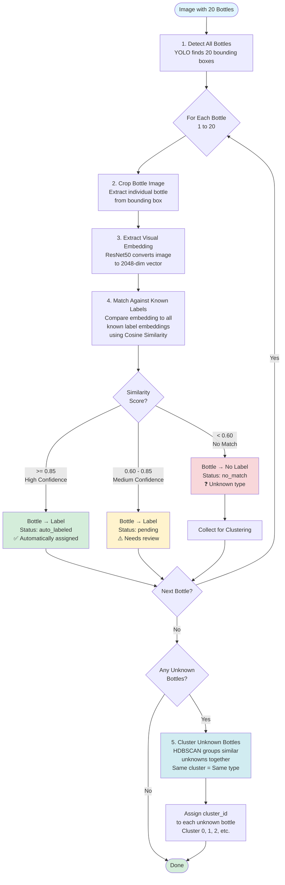

# How 20 Bottles Get Assigned to Labels

## Simple Flow: Image → Labels



## Key Steps Explained

### Step 1: Detection
- YOLO detects all 20 bottles in the image
- Each gets a bounding box (x1, y1, x2, y2)

### Step 2: Cropping
- Each bottle is cropped from the image using its bounding box
- You get 20 individual bottle images

### Step 3: Embedding Extraction
- Each cropped bottle image goes through ResNet50
- Converts visual appearance → 2048-dimensional vector
- This vector represents the bottle's visual features

### Step 4: Label Matching
- For each bottle's embedding, compare it to ALL known label embeddings
- Uses **Cosine Similarity** (measures how similar two vectors are)
- Finds the best matching label

**Matching Logic:**
- **≥ 0.85 similarity** → High confidence → Auto-assigned to label
- **0.60 - 0.85 similarity** → Medium confidence → Assigned but needs review
- **< 0.60 similarity** → No match → Unknown bottle type

### Step 5: Clustering Unknowns
- All bottles that didn't match (similarity < 0.60) are collected
- HDBSCAN clustering groups similar unknowns together
- Bottles in the same cluster likely have the same label
- Each cluster gets an ID (0, 1, 2, etc.)

## Example with 20 Bottles

```
Bottle 1:  Embedding → Match "Coca-Cola 500mL" (0.92) → ✅ auto_labeled
Bottle 2:  Embedding → Match "Pepsi 500mL" (0.88) → ✅ auto_labeled
Bottle 3:  Embedding → Match "Sprite 500mL" (0.75) → ⚠️ pending
Bottle 4:  Embedding → Match "Coca-Cola 500mL" (0.91) → ✅ auto_labeled
Bottle 5:  Embedding → No match (0.45) → ❓ no_match → Cluster 0
Bottle 6:  Embedding → No match (0.42) → ❓ no_match → Cluster 0
Bottle 7:  Embedding → Match "Pepsi 500mL" (0.89) → ✅ auto_labeled
...
Bottle 15: Embedding → No match (0.38) → ❓ no_match → Cluster 1
Bottle 16: Embedding → No match (0.40) → ❓ no_match → Cluster 1
...
```

**Result:**
- 12 bottles → Auto-labeled to known types
- 3 bottles → Pending review
- 5 bottles → Unknown (2 in Cluster 0, 3 in Cluster 1)
